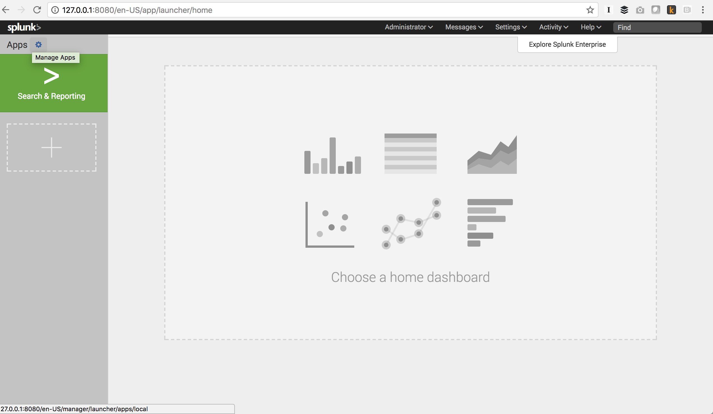
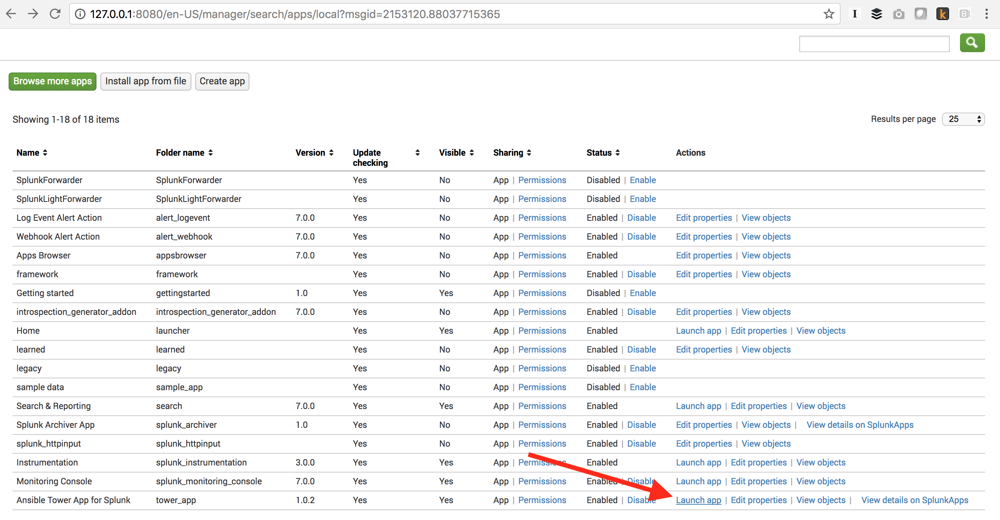
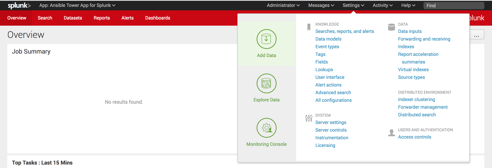
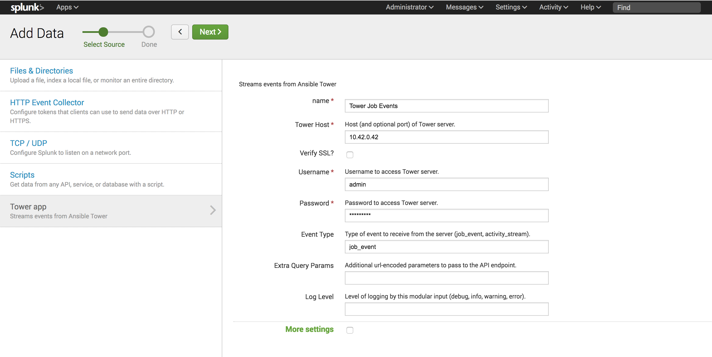

# Ansible Tower and Splunk App Demo

This repo provides an example of setting up Ansible Tower log forwarding to Splunk using the Ansible Tower Splunk app
From there, we will create basic report to highlight a simple example for tracking remediation drift.

## Getting Started
**Pre-Requisites:**  
* A Splunk Enterprise instance  
* An instance of Ansible Tower  
* Network connectivity between thse two applications

Both Ansible & Splunk offer ways to get started with these products in hosted or local examples. If you need one or the other, consider contacting the vendor via their website to sign up for a product trial as necessary.

1. Download the [Ansible Tower App for Splunk](https://splunkbase.splunk.com/app/3319/)
2. Within the Splunk interface, from the home screen select the Apps Gear to 'Manage Apps'

3. Select 'Install App from File', and navigate to where you've stored the Ansible Tower App for Splunk. Select 'Upload' to install the application
4. You should see the Ansible Tower app appear at the bottom of your installed Splunk Apps page, select 'Launch App' to start working in the application 
5. Once inside the app, select Settings > Add Data

6. On the next screen, choose 'Monitor' to connect Ansible Tower  
7. You should now see 'Tower App' on the left side menu, select that to enter information about your Tower Appliance 
8. Perform steps 5-7 twice to add both job_activity and event_stream to your Splunk app.
9. Once complete you should now be able to start reviewing logs from Ansible Tower within Splunk
